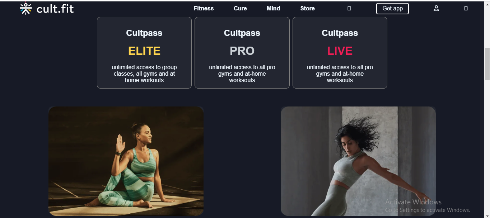

# CultFit
Cult-fit colon

<h3>Live Demo Link https://aquamarine-douhua-4ad200.netlify.app/ </h3>

Cloned a Health-related website with offers GYM and other products.

<h1>Home Page</h1>
    
     

   <h1>[Getting Started]</h1>
    <h3>Execution</h3>
    
If you want to run our project in your local machine

    
Follow the given steps:

    <ul>
        <li>Clone our respository <a href="https://github.com/anshuman2608/racial_rule_4263">https://github.com/soniadiwedi/-scary-flower-3406/</a></li>
        <li>Open our code in VS code </li>
         <li>Congrats !  you have successfully started the application.</li>
    </ul>
        <h1>Built with</h1>
    <ul>
        <li>HTML</li>
        <li>CSS</li>
        <li>Java Script</li>       
    </ul>
        <h1>Creators</h1>
    <ul>
    
   
   <li><a href="">@Anshuman</a></li>
   </ul>
